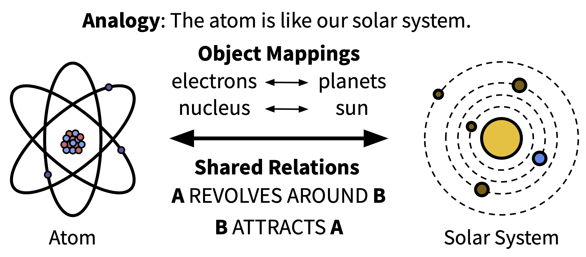

# Analogical Reasoning (AR)

<p align="center"></p>

Code release for the paper **"Unlocking LLM Creativity in Science through Analogical Reasoning"**.

AR is a novel solution generation approach for finding creative scientific approaches. Given a problem, an LLM runs two steps:

1. **Extraction** — problem → analogies in other domains with explicit object mappings.
2. **Search** — analogy → real, existing solutions in that domain.

> Note: The paper evaluates AR on biomedical problems, but the Claude Skill and released prompts are domain-neutral — you can run AR on any scientific problem.

## Usage

If you have a scientific problem you're stuck on and want to try AR to surface interesting new approaches from other domains, there are two ways to run it.

> Note: The examples below use the problem `"How can we make machine learning models more sample-efficient?"` for illustration. Substitute it with any scientific problem you want to explore.

First, clone the repo:

```bash
git clone https://github.com/andrew7shen/ar_science.git
cd ar_science
```

### Option 1 — As a Claude Skill (in Claude Code)

Claude Skills run in [Claude Code](https://claude.com/claude-code). Claude Code loads user-level skills from `~/.claude/skills/`, so install the skill there:

```bash
mkdir -p ~/.claude/skills                            # create the directory if it doesn't exist
cp -r skills/analogical-reasoning ~/.claude/skills/  # copy this skill into it
```

Then, inside Claude Code, invoke the skill by typing `/analogical-reasoning` followed by your problem:

```
/analogical-reasoning How can we make machine learning models more sample-efficient?
```

#### Saving the raw JSON output (optional)

Add `--save` (optionally followed by a path) to the invocation, or just ask Claude to save the output. The saved file contains the full envelope: the original problem, the extraction step (analogies, mappings, rationales, shared relations), and the search step (solutions, key concepts, relevance, citations).

```
/analogical-reasoning --save How can we make machine learning models more sample-efficient?
/analogical-reasoning --save out.json How can we make machine learning models more sample-efficient?
```

If no path is given, output is saved to `ar_output/<YYYYMMDD-HHMMSS>_<problem>.json` in the current working directory.

### Option 2 — With any LLM (via `run_ar.py`)

Run [`prompts/run_ar.py`](prompts/run_ar.py) with your problem as a command-line argument. Defaults to Claude; change the `PROVIDER` constant near the top of `run_ar.py` to `"openai"` or `"gemini"` to use GPT or Gemini instead.

Set up your API keys by copying [`.env.example`](.env.example) to `.env` and filling in the values:

```bash
cp .env.example .env       # then open .env and paste in your API key(s)
```

> Note: `.env` is gitignored — do not commit it. Keep your API keys private.

Then run:

```bash
python prompts/run_ar.py "How can we make machine learning models more sample-efficient?"
```

#### Saving the raw JSON output (optional)

Add the `--save` flag after the problem text. The saved file contains the full envelope: the original problem, the extraction step (analogies, mappings, rationales, shared relations), and the search step (solutions, key concepts, relevance, citations).

```bash
# default path: ar_output/<YYYYMMDD-HHMMSS>_<problem>.json
python prompts/run_ar.py "How can we make machine learning models more sample-efficient?" --save

# custom path
python prompts/run_ar.py "How can we make machine learning models more sample-efficient?" --save out.json
```

## AR Dataset

The Analogical Reasoning (AR) Dataset is stored in `ar_dataset/data/dataset.json`. See [`ar_dataset/README.md`](ar_dataset/README.md) for more information.

## Paper code

The rest of the repo is the evaluation pipeline and case studies used in the paper.

```
ar_science/
├── prompts/                                        # AR prompts
│   ├── extraction.txt
│   ├── search.txt
│   └── run_ar.py                                   # AR Usage Option #2
├── skills/                                         # Claude Skill
│   └── analogical-reasoning/
│       └── SKILL.md                                # AR Usage Option #1
├── src/
│   ├── main.py                                     # CLI entry point
│   ├── orchestrator.py                             # Workflow coordinator
│   ├── config.py                                   # Configuration loader
│   ├── llm_client.py                               # Multi-provider LLM client
│   └── agents/
│       ├── extraction.py                           # Analogy extraction
│       ├── search.py                               # Solution search
│       ├── assessment.py                           # Scoring, ranking & solution novelty
│       ├── baseline.py                             # Baseline workflow
│       └── academic_apis.py                        # Semantic Scholar, arXiv, CrossRef
├── eval/
│   ├── evaluate_on_papers.py                       # Evaluation benchmark
│   ├── analogy_creativity/                         # Analogy creativity
│   │   └── compare_analogies_to_ground_truth.py
│   └── generation_diversity/                       # Generation diversity
│       ├── analyze_embedding_diversity.py
│       ├── compare_embedding_diversity.py
│       ├── embedding_viz_utils.py
│       ├── eval_extraction_diversity.py
│       └── metrics.py
├── ar_dataset/
│   ├── data/                                       # AR Dataset
│   │   └── dataset.json
│   └── code/                                       # Dataset creation pipeline
│       ├── create_dataset.py
│       ├── discovery.py
│       ├── verification.py
│       ├── extraction.py
│       ├── difficulty.py
│       └── utils.py
└── case_studies/
    ├── perturbench/                                # Perturbation effect prediction
    │   ├── fmm_baseline/
    │   ├── la_fmm_baseline/
    │   └── la_reproduced/
    ├── brain_interaction/                          # Brain region interaction
    │   ├── coupling_model_implementation/
    │   └── pcmci_native_implementation/
    ├── oligogym/                                   # Oligonucleotide property prediction
    │   └── pst_tapered_eval/
    └── ccc/                                        # Cell-cell communication
        └── snr_ccc_implementation/
```
